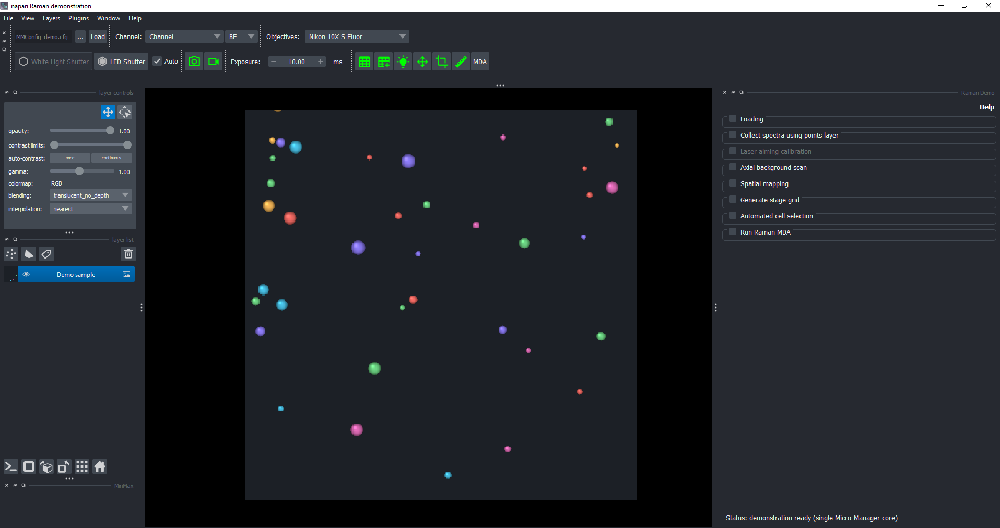

# napari-raman-widget

[](https://github.com/JasonYu1/napari-raman-widget/actions/workflows/ci.yml)

A napari dock widget for controlling the Raman microscopy rig.



*The widget running in demonstration mode with the simulated microscope.*

## What it does

Provides a sidebar with Setup, Selection, Acquire, and Analysis tabs, plus an
optional Assistant tab. Its collapsible sections cover:

- Loading Micro-Manager config and transformer model
- Collecting Raman spectra at clicked points
- Running laser aiming calibration
- Manual recalibration via point selector
- Collecting reference spectra across an axial Z range
- Running spatial Raman mapping only inside a closed region of interest (ROI)
- Automated cell selection inside a mask
- Running a Raman MDA with fluorescence channels and Z stacks

The interface also includes:

- **Inline help** - every field has a hover tooltip explaining what it does,
  and a **Help** button at the top of the panel opens the full PDF user manual.
- **AI assistant** - a built-in chat box that maps plain-English commands to
  the panel's existing actions (see [AI assistant](#ai-assistant-chat-panel)).
- **Dockable plots** - spectra, detector images, scans, calibration views,
  datasets, and logs share the **Raman Plots** workspace, normally a native
  Napari tab alongside the Raman controls in the same dock area.
- **Persistent status** - the current acquisition status stays visible below
  the controls while you change tabs or scroll.

Relative outputs (reference `.zarr` datasets, `grid_scan_*.zarr`, recalibrated
models, and the MDA writer directory) resolve from the current **Active
folder**, shown in **Setup > Loading**. Absolute output paths stay unchanged.

## Video demonstrations

Watch the complete procedure series on the
[napari-raman-widget YouTube channel](https://www.youtube.com/@napari-raman-widget).
The videos cover software loading, hardware connection, point-based spectrum
collection, laser aiming calibration, axial background scanning, spatial
mapping, stage-grid generation, automated cell selection, Raman MDA, dataset
generation, and pixel-to-stage calibration.

## Supporting your hardware

> **For most users, adapting the platform to different microscope hardware
> requires changes only in
> [`raman-control`](https://github.com/JasonYu1/raman-control).** Typically, you only need to
> update its **collector** to communicate with your Raman spectrometer or
> detector and its **DAQ implementation** to communicate with your DAQ board
> and connected devices. The napari widget and
> [`raman-mda-engine`](https://github.com/JasonYu1/raman-mda-engine) use the
> existing `raman-control` interface and should not require hardware-specific
> changes.

## Install

For normal use, install the widget directly from GitHub:

```bash
pip install git+https://github.com/JasonYu1/napari-raman-widget.git
```

This installs the declared dependencies automatically, including the
project-specific [`raman-control`](https://github.com/JasonYu1/raman-control)
and [`raman-mda-engine`](https://github.com/JasonYu1/raman-mda-engine) packages
from their public GitHub repositories.

For development, clone the repository and install it in editable mode:

```bash
git clone https://github.com/JasonYu1/napari-raman-widget.git
cd napari-raman-widget
pip install -e .
```

The AI assistant is optional. To enable it, also install the Anthropic SDK
and set an API key (see [AI assistant](#ai-assistant-chat-panel)):

```bash
pip install anthropic
```

## Run

From inside the repo, with your conda environment active:

```bash
python run_napari.py
```

For the hardware-free simulated microscope, use the dedicated demo launcher:

```bash
python launch_demo_napari.py
```

The demo launcher connects automatically and does not require a Micro-Manager
configuration or coordinate-transform model.
On Windows, you can also double-click `launch_demo_napari.bat`.

### Changing the output folder

In **Setup > Loading**, type or browse to an output folder, then click
**Apply folder**. The entered path is a draft until applied; **Active folder**
shows where future relative outputs will go. Applying creates the folder if
needed and validates it without reconnecting hardware. Hardware **Connect**
also applies the selected folder automatically. The same Apply control is
available in demo mode.

Stop acquisitions, camera/Raman live mode, and MDA before applying: a running
operation in any registered Raman or demo widget blocks the change. This
changes the **process-wide working directory**, so it also affects relative
paths used by other plugins in the same Napari process. Existing files are
not moved, and absolute output paths are unchanged. Existing relative input
file selections are converted to absolute paths when the files exist, so they
continue to refer to the same files after a folder change.

### Arranging plots and controls

Plots and logs initially open in a native **Raman Plots** tab alongside their
Raman controls in the same Napari dock area. Demo results similarly use
**Raman Demo Plots** alongside the demo controls. New results automatically
bring the plots workspace and its newest result to the front. If the controls
are floating or standalone, the workspace may open separately instead of
joining them as a tab.

Inside the workspace, each result has its own tab. Drag these tabs to reorder
them, and hover over a tab to see its complete acquisition title. The **Plots**
button at the top of the Raman controls brings the workspace back if hidden.

The workspace uses Napari's native title-bar controls, just like the Raman
controls panel: **close**, **hide** (the minimize-style icon), and **float**.
Drag the floating window's title bar to an edge of Napari to dock it again;
double-click the title bar to toggle floating. Floating windows use the
platform's window decorations, so their icons can differ from docked panels.
Move or float the plots independently of the controls. New results and
hiding/reopening the workspace preserve your chosen location and floating
state for the current session. Hiding or closing the workspace keeps all results
available through **Plots**; the close button on an individual tab closes
that result. **Plots** also restores a minimized floating workspace.
Closing a live spectrum tab requests a stop after the current exposure;
hiding or floating the workspace lets acquisition continue.

Each spectrum has compact display controls and an expandable **Processing**
section for baseline subtraction and smoothing. These settings change the
display only; acquired data stays unchanged. Dataset navigation separates
time, position, and Z from the spectral processing controls.

In **Acquire > Run Raman MDA**, **Advanced** starts collapsed and holds
autofocus search ranges/points, autofocus and imaging positions,
segment-and-track options, and the refocus/segmentation cadence. Collapsing
it preserves settings. Output, Raman glass offset, exposure, loops, interval,
Z settings, extra channels, and Run/Stop remain outside Advanced.

**Run Raman MDA** opens a pre-run review before creating output or starting
hardware. It shows prepared stage positions, current cell/target counts,
Raman pattern collections, time points, exposure, Z planes, and the resolved
output folder. **Start acquisition** is disabled when setup is missing,
settings are invalid, or another acquisition/live mode is running.
**Back to settings** is the default and keeps your settings without starting.
The duration is a lower bound from current cell Raman exposures and scheduled
intervals, not a predicted completion time: imaging, autofocus, tracking,
motion, readout, and saving add time. Non-empty output folders and intervals
shorter than the Raman exposure workload are flagged. The confirmed review
is also copied to the MDA log.

Plot backgrounds are transparent by default so they blend into Napari's theme.
Check **White background** on a plot for an opaque white canvas; uncheck it
to restore transparency. Axes and labels adjust for readability.

The compact display row groups **Fix Y scale** (where available), **Show
wavenumber**, and **White background**. Spectra always start in pixels.
Wavenumber calibration is optional and is never loaded automatically from
saved defaults: select a calibration JSON in Setup, then opt in with **Show
wavenumber** on a new plot. The checkbox is disabled without a calibration.

Laser aiming calibration has a progress bar and stage readout in its log.
In the calibration result, click a calibration point to inspect its stored
spectrum alongside the image; this does not acquire new data.

The control sidebar groups loading and calibration under **Setup**, stage-grid
and cell tools under **Selection**, measurement workflows under **Acquire**,
and dataset generation under **Analysis**. Pixel-to-stage calibration is inside
**Selection → Generate stage grid**.
The optional AI chat has its own **Assistant** tab.

Dark noise starts as **None** whenever a widget opens, including when an older
defaults file contains a dark-noise path. Select or collect a dark-noise file
to use it for the current session, or click **Clear** to return to None.

### Spatial mapping inside an ROI

Spatial mapping always samples **inside the actual closed ROI**, not its
bounding box. Use a rectangle, ellipse, or polygon in the active Shapes layer;
concave polygons and rotated or sheared shapes are supported. Select only one
ROI. If no shape is selected, the most recently drawn shape is used; selecting
several shapes is rejected. Open lines and paths are not scan regions.

Alternatively, select a **2D Labels layer** and click **Preview grid scan**.
All non-zero label IDs are included together, regardless of the selected label
or selected-label-only display setting. Zero-valued background, holes, and gaps
between objects are excluded. This creates a regular sampling grid inside the
labels, not one centroid per object. The original Labels layer is never changed.

Labels must have the same pixel dimensions and pixel-to-world transform as the
camera image. Shared image/label scaling or rotation is supported; mismatched
or 3D label grids are rejected with an alignment message. The target point count
is across **all labels together per Z plane**, not per object. Coarse spacing can
miss small objects; the preview reports how many label IDs have grid points so
you can increase the target or reduce spacing when needed.

After confirming Start, a read-only **Spatial map points** layer displays the
exact points used for acquisition, with a `label_id` feature for each point.
Cancelling the preview does not create a layer. Saved scans include `label_id`
alongside `grid_pos` and record the source label IDs and all-nonzero selection
rule; keep the original Labels layer to retain the complete segmentation mask.

Choose one of two **Sampling** modes:

- **Total points:** enter **Target points per Z plane** (default 400).
  The widget automatically calculates one uniform X/Y grid spacing to obtain
  approximately that number of points inside the ROI. This is a target, not an
  exact count or a grid side: clipping the grid to the shape changes how many
  points fit. Review the target, actual count, and calculated spacing in the
  preview before starting.
- **Pixel spacing:** enter equal X/Y spacing in camera pixels (default 10 px).
  A square lattice is clipped to the ROI, so its shape and spacing determine
  the actual number of points. The preview reports that count before starting.

Both modes keep all sampling points on a **uniform square lattice** with the
same X and Y spacing. Total-points mode does not add scattered points or move
individual points to force an exact count.

Each mode requires at least two points per Z plane for the acquisition/DAQ
path and supports at most 250,000. Increase the sampling density if a spacing
choice leaves fewer than two points inside the ROI. The old `N × N` grid-side
input is no longer used. Both modes work the same way in the hardware and demo
widgets.

Spacing is measured in **camera-image pixels**, after converting Shapes-layer
coordinates through the napari layer transforms into the reference image.
Keep an unambiguous visible 2D Image layer whose dimensions match the camera.
If multiple matching images are visible, they must have the same transform;
hide unrelated images if their transforms differ. A visible image with no
matching camera-sized reference produces an error rather than a guessed
conversion. Without any visible image, only an untransformed ROI already in
raw camera-pixel coordinates is accepted. The preview identifies the pixel
reference and rejects sample points outside the camera image.

The preview overlays the planned points and ROI outline. Saved scan datasets
retain the actual point coordinates in `grid_pos`, the ROI shape type and
image-pixel vertices in `roi`, and the pixel-reference/source-layer names.
Metadata also records `sampling_mode`, actual `points_per_z`, the target
`requested_points_per_z` when applicable, and `point_spacing_px` (including
automatically calculated spacing), plus planned/completed spectrum counts.
This preserves the selected region and sampling settings with the data.

### Raman band and ratio maps

Open a spatial scan result and expand **Raman map**. Select **Band A area**
and set its lower and upper spectral bounds, or choose **Band A / B ratio**
and also set Band B's bounds. Click **Apply map** to color the measured points
over the brightfield image, with a colorbar. **Points only** restores the
standard point display and is the default for new results.

Use **Colormap** and **Reverse colors** to choose the map's colors. Changes
update an existing overlay and colorbar immediately, without clicking
**Apply map** again or changing values or color limits. Your color choice
persists across Z planes and map modes within that result tab; invalid points
remain gray.

Bounds use spectral pixels by default. To use cm⁻¹, load an optional
wavenumber calibration and enable **Show wavenumber**. Band areas integrate
the raw saved spectra using the trapezoidal rule; units are intensity × pixel
or intensity × cm⁻¹, while ratios are dimensionless. **Processing** settings
still affect only the displayed spectrum, not these map values.
Changing bounds or axis units clears the old map; click **Apply map** again.
Unit changes preserve the selected detector-bin range. Orange and blue bands
on the spectrum indicate A and B respectively.

Click a point to inspect its spectrum, and use the Z controls to review other
planes. The color scale automatically adjusts to the current Z plane.
Maps color only measured points: they do not interpolate across gaps,
holes, or unsampled regions. Invalid values, including non-finite samples or
a ratio denominator at or below 10⁻¹², appear gray and are counted in the map
status. Mapping does not acquire data or change the saved spectra, and a band
map alone does not identify a chemical species.

### Reviewing and stopping acquisitions

Before a **grid scan** or **axial background scan**, a review dialog shows the
selected ROI or point, sampling settings, target versus actual points per Z plane, Z
positions, repeats, total spectrum count, and exact output path. For spatial
mapping, total spectra equals the actual ROI point count multiplied by the
number of Z planes. The preview uses copied settings and does not
acquire data. Choose **Start scan** to proceed or **Cancel** to return; Cancel
is the default keyboard action. Large grids show a sampled display while the
summary still counts every planned acquisition point.

Starting a spatial grid scan automatically turns off camera live imaging
before changing channels/exposure or taking the first image. Demo live mode
and its image timer stop too. Cancelling the preview leaves live mode unchanged;
live imaging stays off after the scan, and a live-stop failure prevents the
scan from starting.

The duration estimate is an **exposure-only lower bound**, not a completion
prediction. It excludes stage movement, settling, readout, autofocus, processing,
and saving. Grid Z offsets are measured from the initial Z minus the configured
Z offset. An axial background scan measures the configured evenly spaced Z
positions around the initial Z, with the chosen repeats at each position; it
does not run an additional fine scan or automatically choose a focus.

**Laser aiming calibration, grid scans, and axial background scans** run as
background jobs in both the hardware and demo widgets. A task strip below the
controls shows actual completed work, the current stage, elapsed time, **Stop**,
and **Log**. The corresponding log also shows progress and a Stop control.
Progress advances when a measured batch or processing stage finishes; it does
not simulate detector progress during an exposure. Conflicting widget controls
are unavailable until the job finishes.

**Stop is cooperative, not an emergency stop.** It waits for the current
hardware step or acquisition batch to finish before cleanup; a long exposure
or repeated-spectrum batch can take time. Keep the application open while it
shows that a stop is pending. Hiding a log does not stop acquisition.

When a requested stop completes normally, grid and axial scans save any
completed measurements to the previewed output path. These datasets carry
`acquisition_status="stopped"`; an uninterrupted scan uses `"complete"`.
Axial data contains only measured Z planes and records `planned_z_planes`.
Partial grid data stores only acquired samples, with `sample_grid_index` and
`sample_z_index` locating them in the planned grid/Z coordinates, and records
`completed_spectra` and `planned_spectra`. No unmeasured spectra are filled in.
If nothing was measured, no dataset is saved. A calibration cancelled before
saving is not saved or installed as a finished calibration. Hardware or storage
failures can prevent saving, so inspect the final status and log.

Logs hide routine successful CCD progress tuples by default. Check **Show
camera diagnostics** to reveal the retained diagnostic lines; warnings and
errors remain visible. This only filters the widget log: original terminal
output is unchanged.

Selection/refinement workflows and Raman MDA are not part of this task strip;
MDA and live spectrum collection retain their existing stop controls.

### One-click launcher (Windows)

A `launch_napari.bat` script is included for convenience. Double-click it to:

1. Activate your conda environment
2. Change into the repo directory
3. Launch napari with the widget

Before using it, edit `launch_napari.bat` to match your setup:

- The `call ... activate.bat <env-name>` line: replace `<env-name>` with
  your own conda environment name.
- The `cd /d <repo-path>` line: replace with the path to your local clone
  of this repo.

You can also pin the launcher to the taskbar or Start menu:

1. Right-click `launch_napari.bat` -> Create shortcut.
2. Right-click the shortcut -> Properties, and prepend `cmd /c ` to the
   Target field so it becomes `cmd /c "<full path>\launch_napari.bat"`.
3. Optionally click Change Icon to give it a recognizable icon.
4. Right-click the shortcut -> Pin to taskbar (or drag it to the desktop).

### Hardware defaults file

To prefill machine-specific configuration, model, wavelength, and selection
fields whenever the hardware widget opens:

1. Copy `napari_raman_defaults.example.json` to
   `napari_raman_defaults.json` in the repository root.
2. Edit the copied file with your paths and preferred values.
3. Restart napari.

The local defaults filename is ignored by Git. Relative paths inside it are
resolved relative to the defaults file. To keep the file elsewhere, set the
`NAPARI_RAMAN_DEFAULTS` environment variable to its full path before launch.

### Slack alerts for Raman MDA failures

Slack alerts are optional and are disabled when no webhook is configured.
Set an incoming-webhook URL in the environment before launching napari:

```powershell
$env:NAPARI_RAMAN_SLACK_WEBHOOK_URL = "https://hooks.slack.com/services/..."
python run_napari.py
```

For a persistent Windows setting, use `setx` and open a new terminal before
launching napari:

```powershell
setx NAPARI_RAMAN_SLACK_WEBHOOK_URL "https://hooks.slack.com/services/..."
```

Do not put the webhook URL in Git or in the shared defaults JSON. The hardware
widget sends a channel alert with the traceback only when Raman MDA setup or
its background acquisition thread raises an exception. Ordinary Python
warnings remain visible in the log, continue using the normal warning rules,
and do not trigger Slack.

Other synchronous operations can use the same helper directly:

```python
from napari_raman_widget.slack_notifications import (
    send_slack_message,
    set_webhook_url,
    slack_notify,
)

@slack_notify
def my_operation():
    ...
```

`set_webhook_url(...)` provides a process-local override when environment
configuration is not convenient, and `send_slack_message(...)` sends a manual
message. Webhook/network failures are logged but never replace the original
microscope exception.

## Inline help and manual

Two forms of built-in documentation ship with the panel:

- **Hover tooltips.** Every editable field and button carries a short
  description shown on mouse-over. The text lives in one central dictionary
  in `napari_raman_widget/field_help.py` (keyed by widget attribute name) and
  is attached in one call, `apply_tooltips(self)`, at the end of the widget's
  constructor. To reword a tooltip, edit that dictionary only - no other file
  changes are needed. The wording is kept consistent with the PDF manual.
- **User manual.** A **Help** link at the top-right of the panel opens
  `napari_raman_widget/resources/napari-raman-widget-manual.pdf`, a detailed
  guide to every section, the layer each workflow consumes, what must be
  prepared first, and what output is produced. The manual's LaTeX source is
  kept alongside it so it can be regenerated.

## AI assistant (chat panel)

The **Assistant** tab is a full-height, terminal-style console inside the
widget. Type directly at the `> ` prompt below the conversation—there is no
separate typing box or Send button. **Enter** sends, **Shift+Enter** inserts
a new line, and **Up/Down** recalls submitted requests. You can select and
copy earlier output, but cannot accidentally edit it. Pasting multiple lines
does not submit them; review the text and press Enter when ready.

**Memory and local profiles:** Chat is private/in-memory by default and is lost
when the widget closes. Check **Save history** above the console to opt in to
local persistence; this saves the current conversation into a new profile.
The choice is remembered, and the active saved profile resumes on the next
launch. Use **History > New profile…** to name a separate conversation, and
the profile selector to switch between them. Switching replaces the AI's
conversation context, transcript, and command recall; it does not replay
commands or restore hardware/plot settings. Profile changes and clearing are
disabled while a request is running.

Uncheck **Save history** (or select **Private session**) to start a fresh,
unsaved conversation. Existing saved profiles are kept. Enabling saving from
a private session always creates a new profile, so it cannot silently merge
one customer's chat into another's. **History > Clear current history…**
clears the active conversation, draft, and command recall, and deletes its
saved chat after confirmation; other profiles are untouched. If saving is
still enabled, future messages will be saved again.

To remove a profile entirely, select it in the profile dropdown, choose
**History > Delete profile…**, and confirm its name. This removes the profile
from the list and deletes its local saved chat, then clears the current chat,
draft, and command recall and starts a fresh **Private session**. Other profiles
are untouched. Deletion cannot be undone in the widget and cannot remove copies
held by the API provider, backups, or other already-open Assistant sessions.
The delete option is disabled during a request and when no saved profile is selected.
If deletion is interrupted, a small non-chat deletion marker prevents that profile
from loading or saving again, including after a restart. The Assistant shows a
warning and lets you retry **Delete profile** to finish removing it.

History files contain chat text and tool inputs/results in **unencrypted local
JSON**, not secure customer accounts. On Windows they are under
`%LOCALAPPDATA%/napari-raman-widget/assistant`; macOS uses
`~/Library/Application Support/napari-raman-widget/assistant`, and Linux uses
`$XDG_DATA_HOME/napari-raman-widget/assistant` (or
`~/.local/share/napari-raman-widget/assistant`). Anyone with access to that OS
account may read them. No API key is deliberately added to history, but text
you type and tool output may contain sensitive information. Do not enter
secrets or sensitive customer data. Resumed context is sent to the configured
Anthropic API with your next request. Clearing local history cannot delete
provider-side records or backups.

Saved history retains at most 30 completed request/tool-loop groups
and 500 visible events, with an additional file-size limit. It is not unlimited
memory. Chats are saved after replies finish; an interrupted request may not
be saved. Invalid or unwritable files produce a visible warning rather than
silently overwriting saved history.

This is an AI command interface, **not a system shell or Python terminal**.
`napari_raman_widget/chat_panel.py` turns plain-English requests into the
panel's existing GUI actions. It never
touches hardware directly - it drives the same methods the buttons call (and
a few napari / Micro-Manager operations), so it reuses every existing range
check and validation. Anything that moves the stage, laser, or shutters pops
a confirmation dialog first; read-only queries run automatically.

**What it can do:**

- Run registered acquisition actions (connect, calibrate, collect spectra, run selection,
  run the Raman MDA, generate a dataset, ...).
- Read state: connection, status, wavelength, grating, image size, selection
  readiness, registered widget settings, active workflow tab, and open plots.
- Change settings without starting a run, or supply all settings consumed by
  an action in the same request (including selection `n_x`, aiming pattern,
  Cellpose options, scan/MDA channels, autofocus, and tracking controls).
- Create napari Points/Shapes layers.
- Set camera exposure and channel; snap; start/stop live.
- Move the stage by a relative offset (clamped by a safety limit), and read
  the current stage position.
- Open napari-micromanager sub-docks (stage controller, MDA, ...).
- Build a `useq` MDA sequence (channels, z-stack, timelapse, positions) and
  load it into the MDA widget, add the current stage position to it, then
  start it.
- List open plots with stable IDs; show, hide, dock, or float the workspace.
- Change supported plot controls: white/transparent background, Y-scale lock,
  pixel/wavenumber axis, display-only smoothing and baseline subtraction,
  and plot-specific view/navigation settings. Unsupported settings are rejected.
- Load or clear optional wavenumber calibration, optionally attaching a loaded
  model to one explicitly selected existing plot. Loading never automatically
  opts a pixel plot into wavenumbers. Clear dark noise, collect new dark spectra
  (with confirmation), or stop live Raman spectra after the current exposure.
- Inspect a calibration result's recorded spectrum by point number, and query
  the calibration log's actual progress/stage and bounded recent messages.
- Start, inspect, or cancel the spectral-axis calibration wizard. Picking
  peaks, entering known Raman shifts, and finishing/saving remain manual.

Try: "List my plots", "Make the current spectrum background white and lock
its Y scale", "Show the recorded spectrum at calibration point 3", or
"What does the calibration log say?" For wavenumbers, supply your calibration
JSON path and say which existing plot to apply it to, then request wavenumber
display. Ask "What can you do?" for the current registered capabilities.

The Assistant gets tool descriptions and explicit state snapshots; it does not
see your screen, read arbitrary source files, inherit developer conversations,
or automatically observe manual UI changes. Progress queries are not background
monitoring. Calibration, grid scans, and axial background scans report their
running state through the task strip and log after launch; a launch response
does not mean acquisition has completed. Individual
spectrum samples are returned only when explicitly requested, with a bounded
output size; ordinary result queries return compact numeric summaries.

**Setup:**

1. `pip install anthropic`
2. Set an Anthropic API key in the environment **before** launching napari,
   e.g. on Windows: `setx ANTHROPIC_API_KEY "sk-ant-..."` (open a new
   terminal afterwards), or per-session `$env:ANTHROPIC_API_KEY = "sk-ant-..."`.
3. Set `MODEL` at the top of `chat_panel.py` to a model your account can
   access.

The assistant is created automatically when `HardwareWidget` opens; no widget
source changes are required.

Action schemas and capability descriptions come from `ACTIONS` in
`chat_panel.py`, including the shared `assistant_*_tools.py` registries.
Add an adapter and registry entry when adding a capability. Coverage tests
include main-widget fields, shared calibration controls, and plot controls;
new UI features do not become Assistant tools automatically.
Pass `ChatPanel(self, confirm=False)` to run recognized commands without the
confirmation dialog (not recommended on live hardware).

## Structure

- `run_napari.py` - entry point; just launches napari with the widget.
- `launch_napari.bat` - Windows one-click launcher (activates env + runs script).
- `napari_raman_widget/hardware_widget.py` - standalone real-hardware widget;
  it contains no simulator imports or demo-mode branches.
- `napari_raman_widget/core_guard.py` - runtime retry protection installed on
  the shared `CMMCorePlus` instance before napari-micromanager is loaded.
- `napari_raman_widget/slack_notifications.py` - optional webhook alerts for
  real exceptions raised during background Raman MDA runs.
- `napari_raman_widget/hardware_defaults.py` - discovers and parses the
  machine-local hardware defaults file.
- `napari_raman_widget/demo_widget.py` - standalone simulated widget used by
  `launch_demo_napari.py`; it does not inherit from `HardwareWidget`.
- `napari_raman_widget/widget.py` - compatibility import for existing code that
  still imports `HardwareWidget` from the old module path.
- `napari_raman_widget/demo/` - simulated world, camera/DAQ backend, collector,
  Cellpose preprocessing, and coordinate transformer.
- `napari_raman_widget/field_help.py` - central hover-tooltip text and the
  `apply_tooltips()` helper.
- `napari_raman_widget/chat_panel.py` - built-in LLM-backed assistant that
  drives the panel's actions.
- `napari_raman_widget/plot_windows.py` - dock-ready Matplotlib plot panels.
- `napari_raman_widget/plot_workspace.py` - shared, tabbed Napari plot dock.
- `napari_raman_widget/log_window.py` - streaming stdout log window.
- `napari_raman_widget/scan_preview.py` - immutable scan plans and confirmation
  previews without hardware operations.
- `napari_raman_widget/scan_workflows.py` - shared previewed grid/axial workflows
  and background calibration launch.
- `napari_raman_widget/acquisition_jobs.py` - serialized calibration/scan jobs,
  progress, and cooperative stop handling.
- `napari_raman_widget/ui_helpers.py` - small Qt helpers.
- `napari_raman_widget/resources/napari-raman-widget-manual.pdf` - the user
  manual opened by the Help link (LaTeX source kept alongside).

Hardware control, calibration, point selection, acquisition workflows, and
spectral processing are included under `napari_raman_widget`. The optional
assistant reports that it is unavailable when the Anthropic SDK or API key is
missing.

## License

`napari-raman-widget` is distributed under the terms of the [BSD-3-Clause](https://spdx.org/licenses/BSD-3-Clause.html) license.
